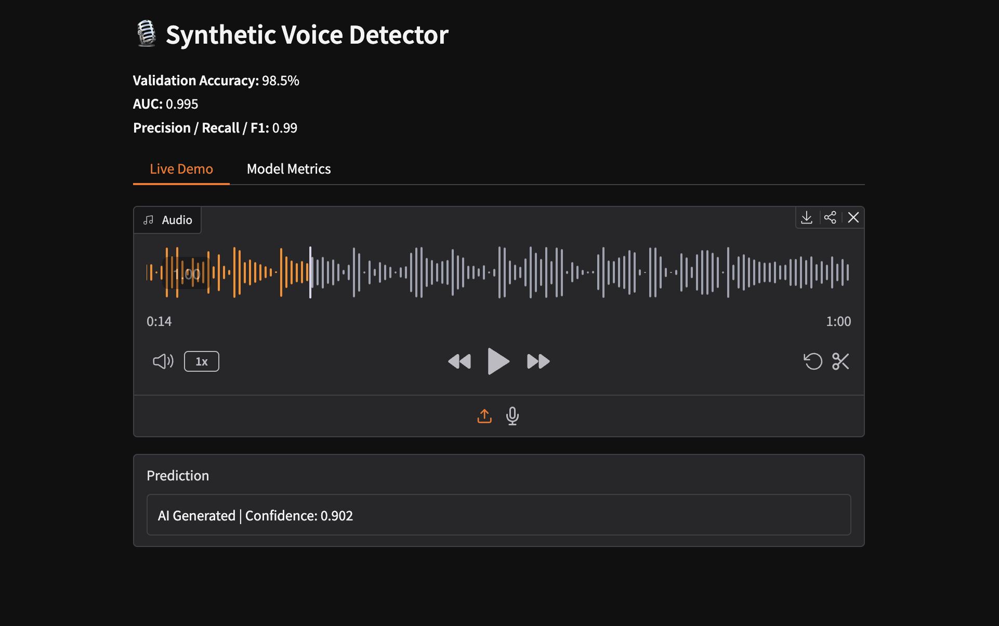
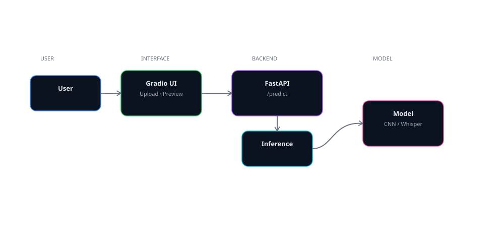
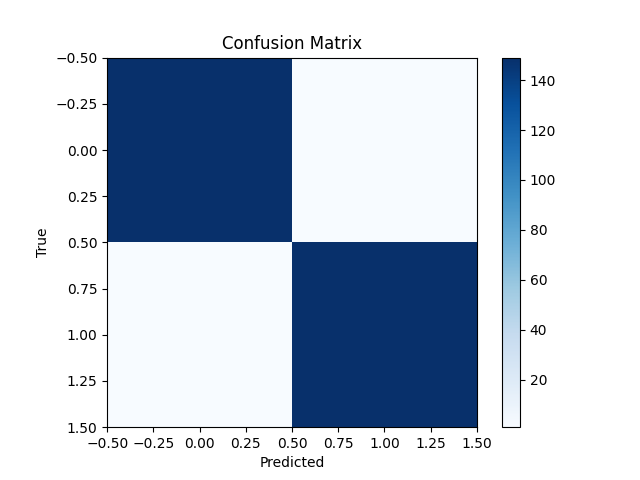

# AI Voice Fraud Detection

> Detect whether a voice is human or AI — powered by **Wav2Vec2**, **CLAP embeddings**, and a **CNN + Log-Mel Spectrogram** architecture trained to distinguish synthetic (TTS/VC) from real human speech.

---

## ⏣ How it works

Raw audio is converted into a Log-Mel Spectrogram — a 2D visual representation of sound frequencies over time. A CNN then classifies this "image" as human or synthetic. An alternative backbone uses OpenAI's Whisper encoder for richer audio representations. Both approaches output a confidence score alongside a Grad-CAM style heatmap showing which audio regions drove the prediction.

---

## ⏣ Highlights

- **Transformer-based Audio Detection** — built on `torch`, `transformers`, and `torchaudio`
- **Pretrained Embedding Support** — integrates `facebook/wav2vec2-base`, `openai/whisper-base`, or `laion/clap`
- **CNN + Log-Mel Spectrogram Pipeline** — lightweight, fast, and accurate on 2000-sample datasets
- **Whisper Classifier variant** — encoder-only Whisper with attention pooling + classification head
- **Inference CLI & Web API** — run as Gradio demo, FastAPI REST service, or containerized microservice
- **Audio Augmentation** — Gaussian noise, time stretch, pitch shift, and random shifts via `audiomentations`
- **Continuous Integration** — preconfigured GitHub Actions for tests, linting, and Docker build
- **Validation Accuracy: 98.5% | AUC: 0.995 | F1: 0.99** — on 2000-sample proof-of-concept dataset

---

## ⏣ Model Overview

| Component | Description |
|---|---|
| **Feature Extractor** | Log-Mel Spectrogram (128 mels, 1024 FFT) |
| **Primary Backbone** | 4-layer CNN with BatchNorm + AdaptiveAvgPool |
| **Alt Backbone** | Whisper encoder (`openai/whisper-small`) with mean pooling |
| **Classifier Head** | Linear → ReLU → Dropout → Linear (2 classes) |
| **Loss** | Cross-entropy (weighted) |
| **Optimizer** | AdamW, weight decay 1e-4 |
| **Device** | Auto-detected: MPS → CUDA → CPU |

---

## ⏣ Whisper Variant (Alternative Backbone)

An alternative backbone using the Whisper encoder for richer audio representations (particularly effective on speech with strong linguistic structure).

  

---

## ⏣ Tech Stack

| Layer | Technology |
|---|---|
| Core ML | PyTorch, torchaudio, transformers |
| Feature Extraction | librosa, Wav2Vec2, Whisper, CLAP |
| Augmentation | audiomentations |
| Web Demo | Gradio |
| REST API | FastAPI + Uvicorn |
| Evaluation | scikit-learn, matplotlib, numpy |
| CI/CD | GitHub Actions |
| Containerization | Docker |

---

## ⏣ Project Structure

Core ML logic lives in `src/aad/` — data loading, model definitions, training loop, inference, and FastAPI server. For full layout and setup instructions, see [SETUP.md](SETUP.md).

---

## ⏣ Model Metrics

### Evaluation Flow

| Metric | Score |
|---|---|
| Validation Accuracy | 98.5% |
| AUC-ROC | 0.995 |
| F1 Score | 0.99 |

> **On dataset size:** These results are on a 2000-sample proof-of-concept dataset (~1000 human, ~1000 synthetic). While metrics are strong, generalization to diverse real-world audio — varied TTS engines, recording conditions, and languages — is not guaranteed at this scale. Expanding the dataset is listed in the roadmap. Current results should be interpreted as proof-of-concept performance, not production benchmarks.

### Confusion Matrix

### ROC Curve

---

## ⏣ CI / CD

GitHub Actions pipeline runs on every push and pull request to `main` / `dev`:

| Step | Tool |
|---|---|
| Linting | `flake8` |
| Formatting | `black`, `isort` |
| Unit Tests | `pytest` |
| Docker Build | Runs on `main` only, after tests pass |

---

## ⏣ Roadmap

- [x] CNN + Log-Mel Spectrogram classifier
- [x] Whisper encoder classifier
- [x] Audio augmentation pipeline
- [x] Gradio web demo
- [x] FastAPI REST API
- [x] CI/CD with GitHub Actions
- [x] Dockerized deployment
- [ ] Wav2Vec2 / CLAP embedding fine-tuning
- [x] Ensemble: CNN + Whisper + Wav2Vec2 fusion
- [ ] Dataset expansion (beyond 2000 samples)
- [ ] Real-time streaming inference (in progress)
- [ ] HuggingFace Hub model card + deployment

---

## ⏣ Contributions

Contributions are welcome — see `CONTRIBUTING.md` for full guidelines.

---

## ⏣ License

MIT © 2025 Janmejai Mudgal

---

## ⏣ Model Card

| Field | Detail |
|---|---|
| **Model Type** | CNN + Log-Mel Spectrogram |
| **Training Data** | 2000-sample proof-of-concept dataset |
| **Languages** | English (primary) |
| **License** | MIT |
| **Contact** | [@jj-mudgal](https://github.com/jj-mudgal) |

### Intended Use
Detecting AI-generated or synthetic speech in audio clips for research, content moderation tooling, and educational purposes.

### Limitations
- Trained on a 2000-sample dataset — generalisation to diverse TTS engines, languages, and recording conditions is not guaranteed
- Performance may degrade on heavily compressed audio (e.g. low-bitrate MP3)
- Not validated on real-time streaming audio
- Should not be used as the sole basis for any consequential decision

### Out-of-Scope Use
This model is not intended for surveillance, speaker identification, or any use that violates individual privacy.

---

## ⏣ Changelog

### Week of May 5 2025
- Fixed broken config, infer, and model_whisper imports
- Implemented full AudioDataset + training loop with early stopping
- Rewrote FastAPI server — proper engine init, batch endpoint, CORS hardening
- Added pytest suite: model, collate, infer, and whisper tests
- Gradio UI — waveform plot, probability bar, correct label logic
- Dockerized with multi-stage build and non-root user
- Pinned all dependency versions for reproducible builds
