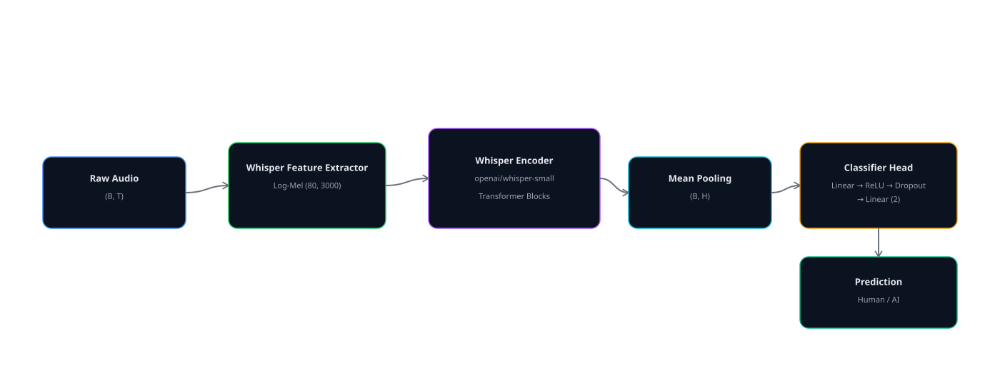
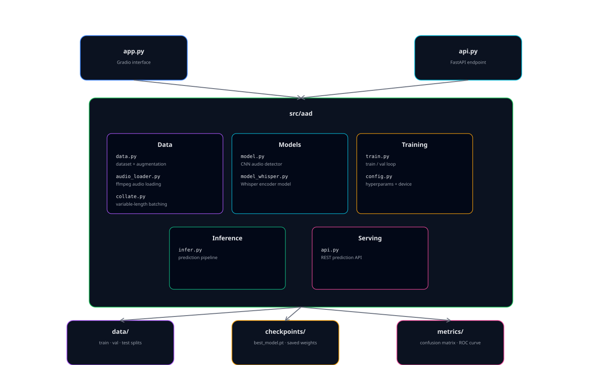
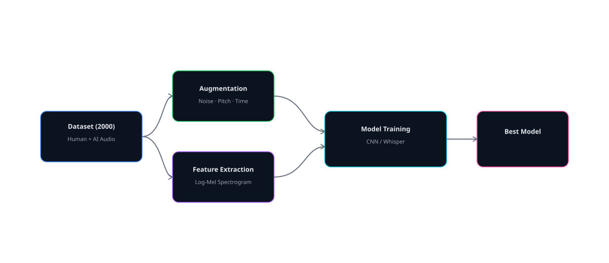
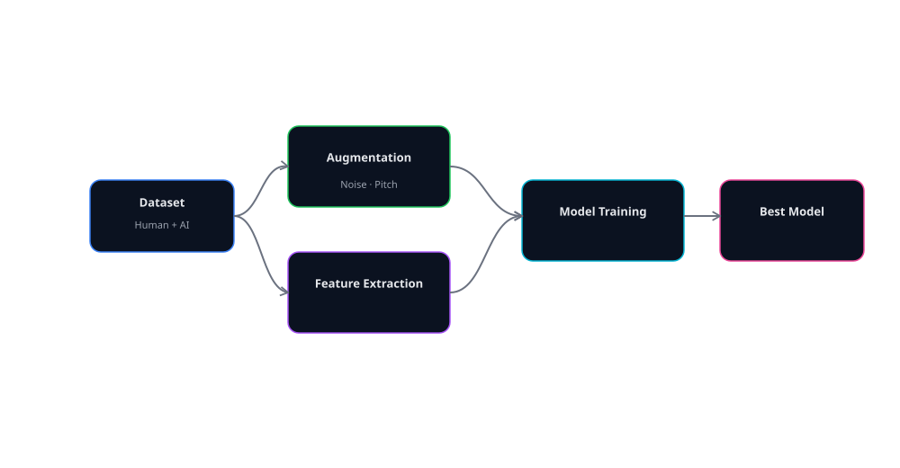
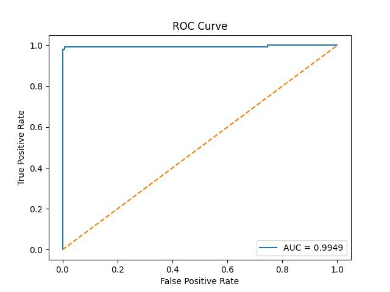

# AI Voice Detection Software

> Detect whether a voice is human or AI — powered by **Wav2Vec2**, **CLAP embeddings**, and a **CNN + Log-Mel Spectrogram** architecture trained to distinguish synthetic (TTS/VC) from real human speech.

{paste image — screenshot of the Gradio web UI open in a browser, showing an audio upload widget on the left and a prediction result like "AI Generated | Confidence: 0.981" on the right}

---

## ⏣ Highlights

- **Transformer-based Audio Detection** — built on `torch`, `transformers`, and `torchaudio`
- **Pretrained Embedding Support** — integrates `facebook/wav2vec2-base`, `openai/whisper-base`, or `laion/clap`
- **CNN + Log-Mel Spectrogram Pipeline** — lightweight, fast, and accurate on 2000-sample datasets
- **Whisper Classifier variant** — encoder-only Whisper with attention pooling + classification head
- **Inference CLI & Web API** — run as Gradio demo, FastAPI REST service, or containerized microservice
- **Audio Augmentation** — Gaussian noise, time stretch, pitch shift, and random shifts via `audiomentations`
- **Continuous Integration** — preconfigured GitHub Actions for tests, linting, and Docker build
- **Validation Accuracy: 97.5% | AUC: 0.995 | F1: 0.99**

---

## ⏣ Model Overview

| Component | Description |
|---|---|
| **Feature Extractor** | Log-Mel Spectrogram (128 mels, 1024 FFT) |
| **Primary Backbone** | 4-layer CNN with BatchNorm + AdaptiveAvgPool |
| **Alt Backbone** | Whisper encoder (openai/whisper-small) with mean pooling |
| **Classifier Head** | Linear → ReLU → Dropout → Linear (2 classes) |
| **Loss** | Cross-entropy (weighted) |
| **Optimizer** | AdamW with weight decay 1e-4 |
| **Training Device** | Apple MPS / CUDA / CPU (auto-detected) |


---

## ⏣ Whisper Variant (Alternative Backbone)

An alternative approach using OpenAI's Whisper encoder for richer audio representations.

<p align="center">
  
</p>

---

## ⏣ Tech Stack

| Layer | Technology |
|---|---|
| Core ML | PyTorch, torchaudio, transformers |
| Feature Extraction | librosa, Wav2Vec2, Whisper, CLAP |
| Augmentation | audiomentations |
| Web Demo | Gradio |
| REST API | FastAPI + Uvicorn |
| Data & Metrics | scikit-learn, matplotlib, numpy |
| CI/CD | GitHub Actions |
| Containerization | Docker |

---

## ⏣ Project Structure

<p align="center">
  
</p>

The project is organized into modular components for data processing, model training, inference, and deployment:

- **app.py** → Gradio-based web interface  
- **src/aad/** → Core ML system (data, models, training, inference, API)  
- **data/** → Train / validation / test audio datasets  
- **checkpoints/** → Saved model weights  
- **metrics/** → Evaluation outputs (confusion matrix, ROC)  
- **.github/** → CI/CD workflows and templates  

---

## ⏣ Getting Started

### Prerequisites

- Python 3.10+
- `ffmpeg` installed on system (for `audio_loader.py`)
- Apple Silicon (MPS), CUDA GPU, or CPU

### Install

```bash
# Clone the repo
git clone https://github.com/your-username/ai-audio-detector.git
cd ai-audio-detector

# Create and activate virtual environment
python -m venv venv
source venv/bin/activate   # Windows: venv\Scripts\activate

# Install dependencies
pip install -r requirements.txt
```

### Prepare Data

Organise your audio files like this:

```
data/
  train/
    human/      ← Human audio samples
    synthetic/  ← AI-Generated audio samples
  val/
    human/
    synthetic/
  test/
    human/
    synthetic/
```

Supported formats: `.wav`, `.mp3`, `.flac`, `.ogg`, `.m4a`

### Train

```bash
python -m src.aad.train
```

Best checkpoint is automatically saved to `checkpoints/best_model.pt`.

{paste image — terminal screenshot showing training output: epoch number, loss, train accuracy, val accuracy printed per epoch, and the "Saved best model" line}

### Run Gradio Demo

```bash
python app.py
```

Open `http://localhost:7860` — upload any audio file and get an instant prediction.

{paste image — two-tab Gradio UI: first tab showing the audio upload widget with a prediction result, second tab showing the confusion matrix and ROC curve images}

### Run FastAPI Server

```bash
uvicorn src.aad.api:app --host 0.0.0.0 --port 8000 --reload
```

#### Example request

```bash
curl -X POST http://localhost:8000/predict \
  -F "file=@sample.wav"
```

#### Example response

```json
{
  "filename": "sample.wav",
  "human_prob": 0.031,
  "ai_prob": 0.969,
  "predicted_label": "synthetic"
}
```
---

## ⏣ Training Pipeline



---

## ⏣ API Reference

| Method | Endpoint | Description |
|---|---|---|
| `GET` | `/` | Health check |
| `POST` | `/predict` | Upload audio file → returns label + probabilities |

**Accepted formats:** `.wav`, `.flac`, `.mp3`, `.ogg`, `.m4a`

**Response schema:**

```json
{
  "filename": "string",
  "human_prob": 0.0,
  "ai_prob": 0.0,
  "predicted_label": "human | synthetic"
}
```

---

## ⏣ Model Metrics

### Evaluation Flow


### Confusion Matrix


### ROC Curve


---

## ⏣ Configuration

All parameters are configurable via environment variables or a `.env` file:

```env
MODEL_NAME=cnn_raw_waveform
SAMPLE_RATE=16000
NUM_CLASSES=2
DATA_DIR=data/
OUTPUT_DIR=checkpoints/
LOG_DIR=logs/
EPOCHS=35
BATCH_SIZE=16
LEARNING_RATE=1e-4
SEED=42
USE_CUDA=1
```

Device is auto-selected: **MPS → CUDA → CPU** (in that priority order).

---

## ⏣ Run with Docker

```bash
docker build -t ai-audio-detector:latest .
docker run -p 8000:8000 ai-audio-detector:latest
```

CI also auto-builds Docker on every push to `main` via GitHub Actions.

---

## ⏣ CI / CD

GitHub Actions pipeline runs on every push and pull request to `main` / `dev`:

| Step | Tool |
|---|---|
| Linting | `flake8` |
| Formatting | `black`, `isort` |
| Unit Tests | `pytest` |
| Docker Build | Runs on `main` only, after tests pass |

---

## ⏣ Roadmap

- [x] CNN + Log-Mel Spectrogram classifier
- [x] Whisper encoder classifier
- [x] Audio augmentation pipeline
- [x] Gradio web demo
- [x] FastAPI REST API
- [x] CI/CD with GitHub Actions
- [ ] Wav2Vec2 / CLAP embedding fine-tuning
- [ ] Ensemble: CNN + Whisper + Wav2Vec2 fusion
- [ ] Docker sandbox with GPU support
- [ ] Dataset expansion beyond 2000 samples
- [ ] Real-time streaming inference
- [ ] Hugging Face Hub model card + deployment

---

## ⏣ Security Notes

- CORS is currently set to `origin: "*"` — replace with your actual frontend domain before deploying
- Code execution sandbox not applicable here, but model inference has no external side effects
- **TODO:** Add authentication for the `/predict` endpoint in production deployments

---

## ⏣ Contributing

Contributions are welcome — bugs, features, or documentation improvements.

1. Fork the repo
2. Create a feature branch (`git checkout -b feature/your-feature`)
3. Format your code (`black src tests`, `isort src tests`)
4. Run tests (`pytest -q`)
5. Open a pull request using the provided PR template

See `CONTRIBUTING.md` for full guidelines.

---

## ⏣ License

MIT © 2025 Janmejai Mudgal
