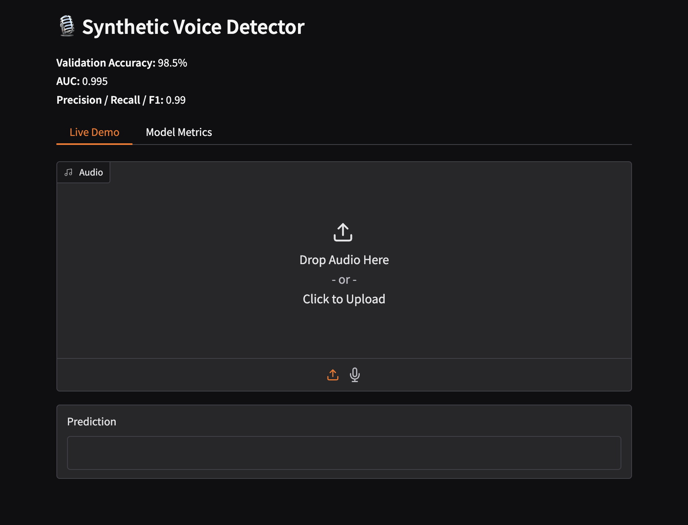

# Setup & Installation

## ⏣ Prerequisites

- Python 3.10+
- `ffmpeg` installed on your system (required by `audio_loader.py`)
- Apple Silicon (MPS), CUDA GPU, or CPU

---

## ⏣ Install

```bash
git clone https://github.com/jj-mudgal/AI-VOICE-DETECTION-SOFTWARE
cd AI-VOICE-DETECTION-SOFTWARE

python -m venv venv
source venv/bin/activate   # Windows: venv\Scripts\activate

pip install -r requirements.txt
```

---

## ⏣ Data Structure

Organise your audio files like this:

```
data/
  train/
    human/        ← Human audio samples
    synthetic/    ← AI-generated audio samples
  val/
    human/
    synthetic/
  test/
    human/
    synthetic/
```

Supported formats: `.wav`, `.mp3`, `.flac`, `.ogg`, `.m4a`

---

## ⏣ Train

```bash
python -m src.aad.train
```

Best checkpoint is automatically saved to `checkpoints/best_model.pt`.


All parameters are configurable via `.env`:

```env
MODEL_NAME=cnn_raw_waveform
SAMPLE_RATE=16000
NUM_CLASSES=2
DATA_DIR=data/
OUTPUT_DIR=checkpoints/
LOG_DIR=logs/
EPOCHS=35
BATCH_SIZE=16
LEARNING_RATE=1e-4
SEED=42
USE_CUDA=1
```

Device is auto-selected: MPS → CUDA → CPU.

---

## ⏣ Run Gradio Demo

```bash
python app.py
```

Open `http://localhost:7860` — upload any audio file and get an instant prediction.



---

## ⏣ Run FastAPI Server

```bash
uvicorn src.aad.api:app --host 0.0.0.0 --port 8000 --reload
```

### Example request

```bash
curl -X POST http://localhost:8000/predict \
  -F "file=@sample.wav"
```

### Example response

```json
{
  "filename": "sample.wav",
  "human_prob": 0.031,
  "ai_prob": 0.969,
  "predicted_label": "synthetic"
}
```

Accepted formats: `.wav`, `.flac`, `.mp3`, `.ogg`, `.m4a`

---

## ⏣ Run with Docker

```bash
docker build -t ai-audio-detector:latest .
docker run -p 8000:8000 ai-audio-detector:latest
```

Docker image also builds automatically on every push to `main` via GitHub Actions.

---

## ⏣ Project Structure


---

## ⏣ API Reference

| Method | Endpoint | Description |
|---|---|---|
| `GET` | `/` | Health check |
| `POST` | `/predict` | Upload audio → returns label + probabilities |

Response schema:

```json
{
  "filename": "string",
  "human_prob": 0.0,
  "ai_prob": 0.0,
  "predicted_label": "human | synthetic"
}
```

> **Note:** CORS is currently set to `origin: "*"` — replace with your frontend domain before deploying to production. Consider adding authentication to `/predict` for any public-facing deployment.
